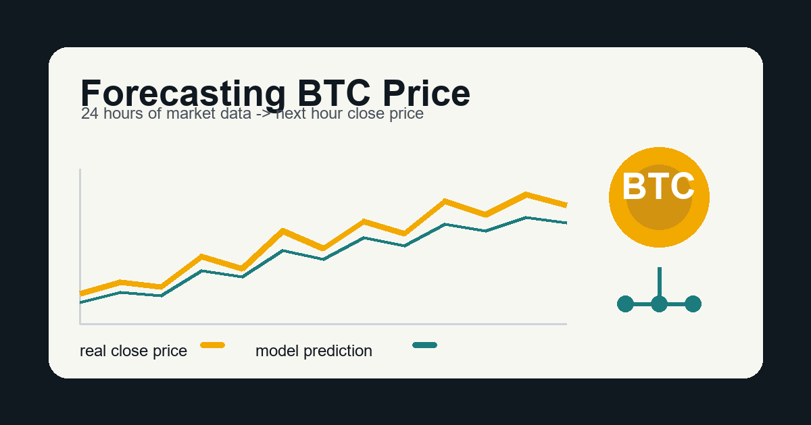
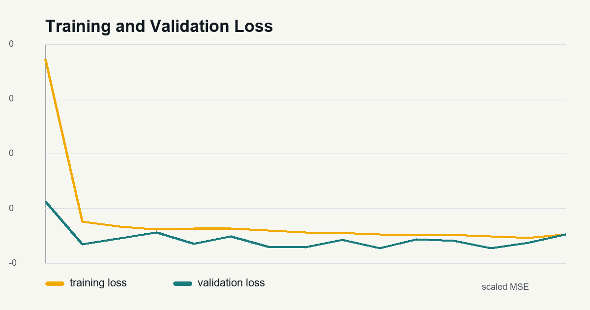
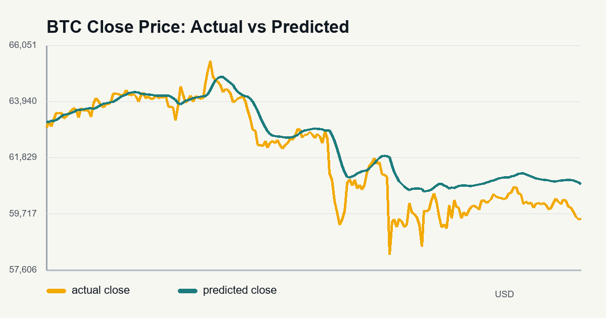

# How I Tried to Forecast BTC Price with Time Series Data



Bitcoin is one of those topics where everyone wants to know the same thing: when is the right time to invest? Of course, no model can tell the future perfectly, especially with something as volatile as BTC. But this project was a good way for me to understand how time series forecasting works and how past market data can be used to make a prediction for the next hour.

For this task, my goal was to use the previous 24 hours of BTC market data and predict the closing price for the following hour. I used BTC minute-level data from Coinbase and Bitstamp, converted it into hourly data, prepared it for a neural network, and trained an LSTM model.

## What is Time Series Forecasting?

Time series forecasting is when we try to predict a future value using values from the past. The important part is that order matters. For example, BTC prices from 10:00, 11:00, and 12:00 are not just random rows in a table. They are connected by time.

This is different from normal tabular prediction because the model needs to understand patterns across a sequence. In BTC, the price can move very quickly, so I wanted the model to look at a small recent window instead of only one row. That is why I used the past 24 hours as the input.

## My Preprocessing Method

The original datasets had one row per minute. That is a lot of rows, and for this project I did not need every single minute. So the first thing I did was resample the data into hourly rows.

For each hour, I kept these features:

- `Open`
- `High`
- `Low`
- `Close`
- `Volume_(BTC)`
- `Volume_(Currency)`
- `Weighted_Price`

I used the first open price of the hour, the highest high, the lowest low, the last close price, summed volume values, and the average weighted price. After that, I combined the Coinbase and Bitstamp data and grouped matching timestamps by their mean value.

I also removed rows with missing values because missing timestamps or close prices would make the sequences unreliable.

One important detail is that I scaled the features using only the training data. I did this because if I used validation or test data to calculate the mean and standard deviation, the model would indirectly see information from the future. That would make the result look better than it really is.

For the final training run, I also scaled the target close price during training and converted the predictions back to USD for evaluation. This made the model easier to train while still letting me report the final error in real dollar values.

After scaling, I created sequences. Each input sequence contains 24 hourly rows, and the target is the BTC close price for the next hour.

So the model input looks like this:

```text
previous 24 hours of market features -> next hour close price
```

## How I Used `tf.data.Dataset`

After preprocessing, I saved the arrays into a compressed `.npz` file. Then, in the training script, I loaded the arrays and converted them into TensorFlow datasets with `tf.data.Dataset`.

I used `tf.data.Dataset` because it makes training cleaner and more efficient. Instead of manually feeding batches to the model, TensorFlow handles batching and prefetching.

My dataset pipeline was:

```python
dataset = tf.data.Dataset.from_tensor_slices((x, y))
dataset = dataset.batch(batch_size).prefetch(tf.data.AUTOTUNE)
```

For the training dataset, I also shuffled the data with a fixed seed. Validation and test data were not shuffled.

## Model Architecture

For the model, I used an LSTM because LSTMs are made for sequential data. Since BTC prices depend on what happened before, an LSTM made more sense than a basic dense neural network.

The architecture I used was:

```text
Input: 24 hours x 7 features
LSTM(64, return_sequences=True)
Dropout(0.2)
LSTM(32)
Dropout(0.2)
Dense(16, relu)
Dense(1)
```

The first LSTM layer returns sequences so the second LSTM layer can continue learning from the time steps. I added dropout to reduce overfitting. The final dense layer outputs one value: the predicted BTC close price for the next hour.

I compiled the model with:

- Adam optimizer
- Mean Squared Error loss
- Mean Absolute Error metric
- Root Mean Squared Error metric

I also used early stopping and model checkpointing. Early stopping helps stop training when validation loss is no longer improving, and checkpointing saves the best model.

## Results

For the final test run, I used 90 days of hourly BTC-USD market data from CoinGecko, from 2026-03-31 to 2026-06-28. The original Coinbase and Bitstamp CSV files were not stored in my local repo when I tested, so I used the same preprocessing idea on this public hourly BTC data.

The dataset had 2,166 hourly rows. After making 24-hour windows, the split was:

- train: 1,704 sequences
- validation: 216 sequences
- test: 216 sequences

I trained the LSTM for up to 20 epochs, but early stopping finished the run after 15 epochs. The best validation loss was about `0.0061` on the scaled target.



After converting the predictions back to USD, the final metrics were:

- train MAE: `$346.71`
- train RMSE: `$477.57`
- validation MAE: `$315.47`
- validation RMSE: `$436.62`
- test MAE: `$588.89`
- test RMSE: `$815.05`



The model followed the general direction of the BTC close price, but it was not perfect. On the test set, the average error was about `$588.89`. With BTC prices moving a lot even inside one day, this result makes sense to me. It is useful enough to show that the model learned something, but it is not something I would trust alone for investing.

The main thing I looked for was whether the validation loss followed the training loss. If training loss goes down but validation loss starts going up, that usually means the model is overfitting. In my run, the validation loss improved early, then started moving around, so early stopping helped avoid continuing too long.

## What I Learned

This project helped me understand that time series forecasting is not only about choosing a model. The preprocessing is just as important. If the timestamps are not handled correctly, or if scaling uses future data, the model result can become misleading.

I also learned that BTC is difficult to forecast because price movement depends on many outside factors, like news, market sentiment, and sudden trading activity. My model only used historical market data, so it can learn patterns in the numbers, but it cannot understand why something happened.

If I had more time, I would try:

- adding more technical indicators
- comparing LSTM with GRU
- predicting percentage change instead of raw price
- testing different window sizes
- adding better graphs for error analysis

## Conclusion

In this project, I built a BTC forecasting pipeline from preprocessing to model training. I converted minute-level BTC data into hourly data, created 24-hour input sequences, used `tf.data.Dataset` for batching, and trained an LSTM model to predict the next hour closing price.

I would not use this model alone to decide when to invest, but I think it is a useful starting point. It shows how machine learning can be used with financial time series data, and it also shows why forecasting markets is not simple.

You can find my code here:

https://github.com/Nihad-Suleyman/holbertonschool-machine_learning/tree/main/supervised_learning/time_series
